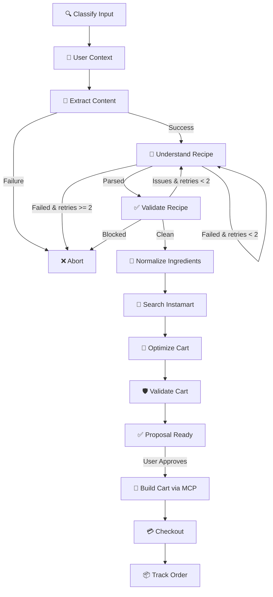

# 🍳 InstaChef AI — Cooking Commerce Agent

**Turn any recipe video, blog, or text into a real Swiggy Instamart grocery order.**

InstaChef AI is a **10-node agentic pipeline** that watches a YouTube video, reads an Instagram Reel, parses a recipe blog, or accepts raw text — then autonomously extracts ingredients, normalizes quantities, searches Instamart, optimizes your cart for minimal waste, and places the order. All in under 30 seconds.

---

## ✨ Why This Exists

You're watching a cooking video. The recipe looks amazing. You want to try it tonight. But:
- You pause the video, copy the ingredient list
- Open Swiggy Instamart
- Search for each ingredient one by one
- Figure out the right pack sizes (200g paneer? 500g?)
- Realize you already have turmeric and salt at home
- Place the order 20 minutes later

**InstaChef AI does all of this in one click.**

---

## 🧠 Architecture — A Real Agentic Pipeline

This is **not** a wrapper around an LLM prompt. It's a production-grade state machine built on **LangGraph** with conditional routing, validation gates, retry loops, and human-in-the-loop checkpoints.



### 10 Pipeline Nodes

| # | Node | What It Does |
|---|------|-------------|
| 1 | **Classify** | Detects input type: YouTube, Instagram Reel, blog URL, or raw text |
| 2 | **User Context** | Fetches order history, go-to items, brand preferences, dietary signals via Swiggy MCP |
| 3 | **Extract** | 3-tier fallback for YouTube (subtitle API → faster-whisper → OpenAI Whisper), Apify for Instagram, recipe-scrapers + trafilatura for blogs |
| 4 | **Understand** | LLM recipe parsing with multi-provider fallback (NVIDIA NIM → Gemini). Explicit Indian language translation (30+ desi ingredient mappings) |
| 5 | **Validate Recipe** | Auto-repair gate: deduplication, quantity capping, core-ingredient heuristics |
| 6 | **Normalize** | Lightweight fuzzy string matching against ingredient database, unit conversion (g/ml/tsp/tbsp/cups/kg) |
| 7 | **Search Instamart** | 8× parallel product search via Swiggy MCP with synonym retry fallback |
| 8 | **Optimize** | Multi-factor ranking: name relevance (35%), pack-size efficiency (25%), price (15%), stock (10%), brand preference (10%), go-to bonus (5%) |
| 9 | **Validate Cart** | Final validation gate: budget sanity, coverage check, waste analysis |
| 10 | **Checkout** | Real cart building + order placement via Swiggy MCP OAuth 2.1 |

### 2 Validation Gates

The pipeline has **two hard gates** that can reject and re-route:
- **Recipe Validation Gate**: After LLM parsing — checks for duplicate ingredients, unreasonable quantities (>5kg of anything?), and missing core ingredients. Auto-repairs what it can, aborts or retries what it can't.
- **Cart Validation Gate**: After optimization — checks total budget sanity, ingredient coverage ratio, and waste percentages.

---

## 🔥 Key Differentiators

### Pantry Intelligence
> "We skipped salt, oil, water, and turmeric because most Indian kitchens already have these."

The pipeline detects **pantry staples** and flags them separately. No more buying 1kg of salt for a recipe that needs a pinch.

### Waste Minimization
> "We picked 200g paneer instead of 500g because you only need 150g — saving ₹80 and 60% waste."

Every product is scored for **pack-size efficiency**. The optimizer picks the smallest viable pack to minimize food waste.

### User Personalization
Order history analysis detects:
- **Go-to items** (your usual "Amul Butter" gets priority)
- **Brand preferences** (always picks your preferred brand)
- **Dietary signals** (vegetarian? vegan? detected automatically)

### Multi-Language Support
Explicit support for **6 Indian languages** in video transcripts: English, Hindi, Tamil, Telugu, Kannada, Marathi. Plus 30+ desi ingredient name translations hardcoded into the extraction prompt (dhaniya → coriander, haldi → turmeric, etc.).

### Multi-Provider LLM Resilience
Primary: **NVIDIA NIM** (Llama 3.1 8B). Fallback: **Google Gemini 2.0 Flash**. If one provider is down, the pipeline automatically switches to the other.

---

## 🛠 Tech Stack

| Layer | Technology |
|-------|-----------|
| **Orchestration** | LangGraph (state machine with conditional edges) |
| **Backend** | FastAPI + Uvicorn |
| **Frontend** | Next.js 14 + Tailwind CSS |
| **LLM** | NVIDIA NIM (Llama 3.1 8B) + Gemini 2.0 Flash (fallback) |
| **Semantic Search** | Standard library `difflib` (lightweight fuzzy string matching) |
| **Commerce** | Swiggy MCP (OAuth 2.1, JSON-RPC 2.0) |
| **Cache** | Redis |
| **Transcription** | YouTube Transcript API → faster-whisper → OpenAI Whisper |
| **Instagram** | Apify (3-actor fallback) + public page scraping |
| **Streaming** | Server-Sent Events (SSE) for real-time pipeline progress |

---

## 🚀 How to Run Locally

### Prerequisites
- Python 3.12+
- Node.js 20+
- Docker (for Redis)

### Step 1 — Start Redis
```bash
docker run -d --name redis -p 6379:6379 redis:7-alpine
```

### Step 2 — Backend setup
```bash
cd backend
python -m venv venv
source venv/bin/activate  # Windows: venv\Scripts\activate
pip install -r requirements.txt
```

### Step 3 — Configure API keys
Copy `backend/.env` and fill in your keys:
```env
NVIDIA_API_KEY=your_nvidia_nim_key
GEMINI_API_KEY=your_gemini_key        # Optional fallback
RAPIDAPI_KEY=your_rapidapi_key        # Optional, for Instagram Reels
OPENAI_API_KEY=your_openai_key        # Optional, for Whisper fallback
MOCK_MCP=true                         # Set to false with real Swiggy creds
```

### Step 4 — Start backend
```bash
cd backend
uvicorn app.main:app --reload --port 8000
```

### Step 5 — Frontend (new terminal)
```bash
cd frontend
npm install
npm run dev
```

### Step 6 — Open browser
Navigate to [http://localhost:3000](http://localhost:3000)

### Step 7 — Run the demo
1. Click **Connect Swiggy Account** (instant in mock mode)
2. Paste: `https://www.youtube.com/watch?v=9WXinXCkJoI` (Butter Chicken)
3. Click **Cook This →**
4. Watch the 10-node pipeline run in real-time
5. Review the AI-optimized cart (pantry items skipped, waste minimized)
6. Click **Place Order**
7. Watch live order tracking

### Demo Data Seeding
```bash
python backend/scripts/seed_demo_cache.py
```
Pre-caches demo transcriptions for consistently fast pipeline runs.

---

## 📦 Deployment

See [deployment_guide.md](./deployment_guide.md) for instructions on deploying to:
- **Vercel** (Frontend)
- **Render** (Backend via Docker)
- **Upstash** (Serverless Redis)

---

## 📄 License

Built for the Swiggy Builders Club Hackathon 2026.
>>>>>>> a230fa4 (Initial commit: InstaChef AI Launch)
